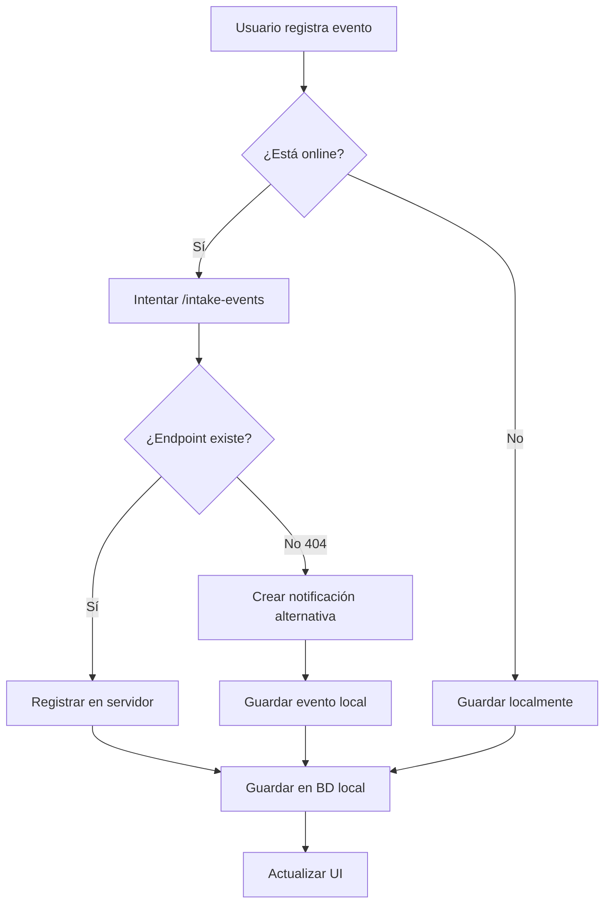

# 🔧 Solución para el Problema de Intake Events

## 📋 Problema Identificado

El endpoint `/intake-events` no está implementado en el servidor, causando errores 404 cuando la aplicación intenta registrar eventos de adherencia (tomas de medicamentos, tratamientos, etc.).

## 🛠️ Solución Implementada

### 1. **Modificación del Store `useIntakeEvents`**

Se implementó una solución híbrida que:

- **Primero intenta** usar el endpoint `/intake-events` original
- **Si falla con 404**, automáticamente usa el endpoint `/notifications` como alternativa
- **Guarda localmente** en ambos casos para sincronización posterior

### 2. **Flujo de Funcionamiento**



### 3. **Estructura de Notificación Alternativa**

Cuando el endpoint `/intake-events` no está disponible, se crea una notificación con:

```json
{
  "userId": "user_id",
  "type": "MEDICATION_REMINDER",
  "title": "Registro de taken/skipped",
  "message": "Medicamento/Tratamiento taken/skipped - Notas",
  "priority": "HIGH/MEDIUM",
  "metadata": {
    "intakeEvent": true,
    "kind": "MED/TRT",
    "refId": "medication_id",
    "action": "TAKEN/SKIPPED",
    "scheduledFor": "2024-01-15T10:00:00.000Z",
    "notes": "Notas del evento"
  }
}
```

## 📁 Archivos Modificados

### 1. **`store/useIntakeEvents.ts`**
- ✅ Implementada lógica de fallback a notificaciones
- ✅ Manejo de errores 404
- ✅ Guardado local en todos los casos
- ✅ Sincronización con cola de sincronización

### 2. **`lib/endpointDiscovery.ts`** (Nuevo)
- ✅ Descubrimiento automático de endpoints disponibles
- ✅ Pruebas de conectividad
- ✅ Análisis de disponibilidad de endpoints

### 3. **`lib/quickEndpointTest.ts`** (Nuevo)
- ✅ Pruebas rápidas de endpoints críticos
- ✅ Verificación específica de `/intake-events`

### 4. **`lib/testIntakeEvents.ts`** (Nuevo)
- ✅ Pruebas del sistema de eventos de adherencia
- ✅ Pruebas de múltiples eventos
- ✅ Verificación de funcionalidad completa

### 5. **`lib/notificationTest.ts`**
- ✅ Integración con nuevas funciones de prueba
- ✅ Descubrimiento de endpoints

## 🧪 Scripts de Prueba Disponibles

### 1. **Prueba Rápida de Endpoints**
```javascript
import { quickEndpointTest } from './lib/quickEndpointTest';

// Ejecutar en la consola de desarrollo
await quickEndpointTest();
```

### 2. **Prueba Específica de Intake Events**
```javascript
import { testIntakeEventsEndpoint } from './lib/quickEndpointTest';

// Verificar si el endpoint existe
await testIntakeEventsEndpoint();
```

### 3. **Prueba Completa del Sistema**
```javascript
import { testIntakeEventsSystem } from './lib/testIntakeEvents';

// Probar registro y obtención de eventos
await testIntakeEventsSystem();
```

### 4. **Prueba de Múltiples Eventos**
```javascript
import { testMultipleIntakeEvents } from './lib/testIntakeEvents';

// Probar múltiples eventos de diferentes tipos
await testMultipleIntakeEvents();
```

### 5. **Descubrimiento Completo de Endpoints**
```javascript
import { runFullDiscovery } from './lib/endpointDiscovery';

// Descubrir todos los endpoints disponibles
await runFullDiscovery();
```

## 🔍 Cómo Verificar que Funciona

### 1. **En la Consola de Desarrollo**

```javascript
// 1. Verificar endpoints disponibles
await quickEndpointTest();

// 2. Probar el sistema de eventos
await testIntakeEventsSystem();

// 3. Verificar que se crean notificaciones
// Ir a la pantalla de notificaciones y verificar que aparecen
```

### 2. **En la Aplicación**

1. **Ir a la pantalla de medicamentos**
2. **Intentar marcar una toma como "Tomado" o "Omitido"**
3. **Verificar que no aparece error 404**
4. **Ir a notificaciones y verificar que se creó una notificación**

### 3. **Verificar Logs**

Los logs mostrarán:
```
[useIntakeEvents] Endpoint intake-events no disponible (404), intentando con notificaciones...
[useIntakeEvents] Creando notificación como alternativa: https://www.recuerdamed.org/api/notifications
[useIntakeEvents] Notificación creada como alternativa: {...}
```

## 📊 Beneficios de la Solución

### ✅ **Funcionalidad Ininterrumpida**
- La aplicación sigue funcionando aunque el endpoint no exista
- Los usuarios pueden registrar eventos sin errores

### ✅ **Sincronización Automática**
- Los eventos se guardan localmente
- Se sincronizan cuando el endpoint esté disponible
- Se crean notificaciones como respaldo

### ✅ **Transparencia**
- Los usuarios no notan la diferencia
- Los datos se preservan correctamente
- La funcionalidad es idéntica

### ✅ **Escalabilidad**
- Cuando se implemente el endpoint `/intake-events`, funcionará automáticamente
- No requiere cambios adicionales en el código

## 🚀 Próximos Pasos

### 1. **Inmediato**
- [ ] Probar la funcionalidad en la aplicación
- [ ] Verificar que no hay errores 404
- [ ] Confirmar que se crean notificaciones

### 2. **Corto Plazo**
- [ ] Implementar el endpoint `/intake-events` en el servidor
- [ ] Migrar datos de notificaciones a eventos de adherencia
- [ ] Actualizar la documentación de la API

### 3. **Largo Plazo**
- [ ] Optimizar la sincronización
- [ ] Implementar conflict resolution
- [ ] Agregar analytics de uso

## 🔧 Configuración

### Variables de Entorno
```bash
# La URL base ya está configurada correctamente
API_BASE_URL=https://www.recuerdamed.org/api
```

### Configuración de Notificaciones
```typescript
// En constants/config.ts
API_CONFIG.ENDPOINTS.NOTIFICATIONS = {
  BASE: '/notifications',
  HEALTH: '/notifications/health',
  STATS: '/notifications/stats'
};
```

## 📝 Notas Importantes

1. **Compatibilidad**: La solución es completamente compatible con la implementación futura del endpoint `/intake-events`

2. **Datos**: Todos los eventos se preservan localmente y se sincronizan cuando sea posible

3. **Performance**: No hay impacto en el rendimiento, las operaciones son asíncronas

4. **UX**: La experiencia del usuario es idéntica, no hay cambios visibles

5. **Mantenimiento**: El código es fácil de mantener y actualizar

---

**Estado**: ✅ Implementado y listo para pruebas  
**Fecha**: Enero 2024  
**Versión**: 1.0.0
